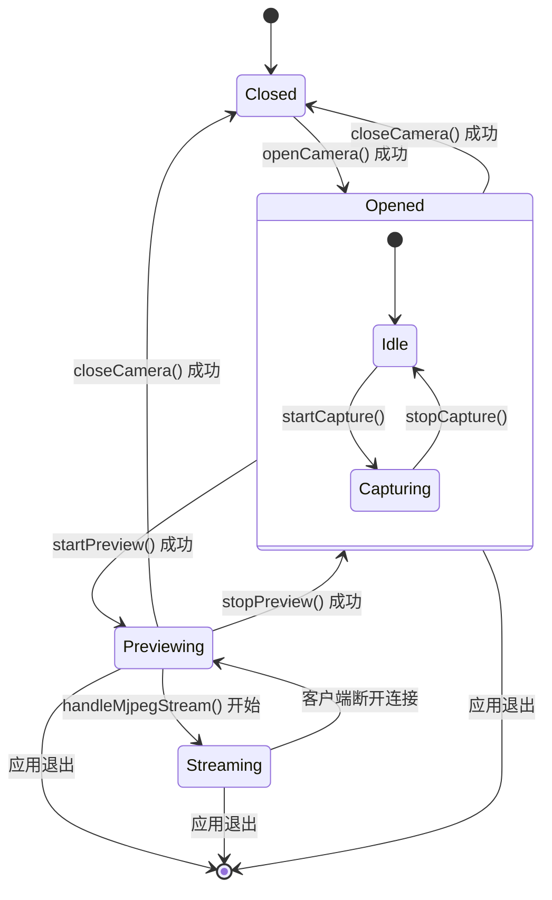
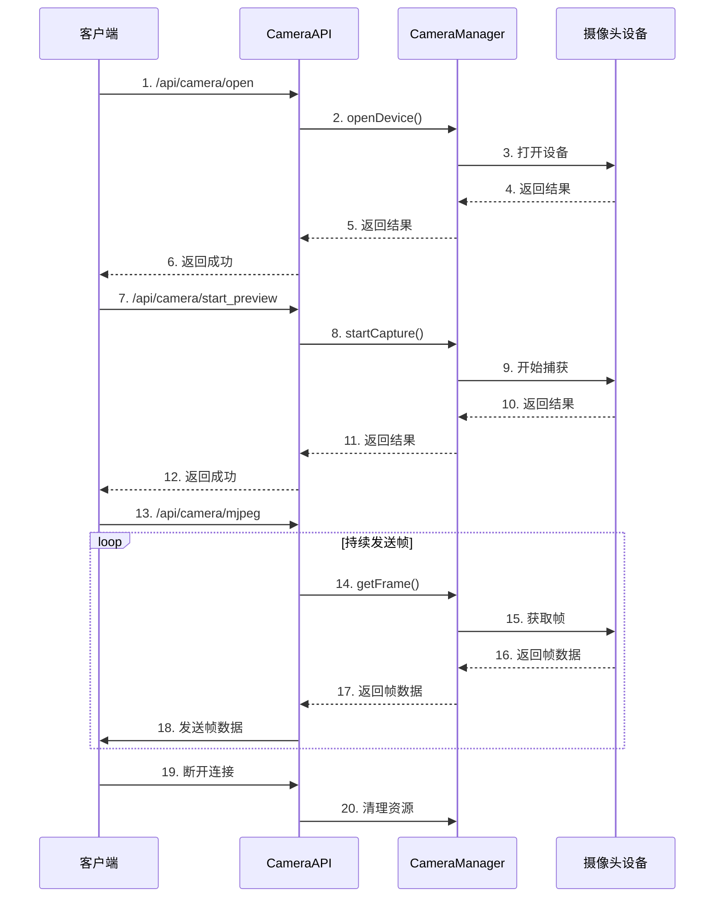

# 摄像头工作流程文档

## 目录
- [1. 概述](#1-概述)
- [2. 主要流程](#2-主要流程)
  - [2.1 初始化流程](#21-初始化流程)
  - [2.2 摄像头操作流程](#22-摄像头操作流程)
- [3. 状态转换](#3-状态转换)
- [4. API 接口说明](#4-api-接口说明)
- [5. 时序图](#5-时序图)
- [6. 关键点说明](#6-关键点说明)
- [7. 建议](#7-建议)

## 1. 概述

本文档详细描述了摄像头模块的工作流程，包括设备初始化、状态转换、API 接口以及关键流程的时序图。

## 2. 主要流程

### 2.1 初始化流程

```
[应用启动] → [初始化CameraManager] → [注册API路由]
```

### 2.2 摄像头操作流程

#### 打开摄像头
```
[前端请求 /api/camera/open]
       ↓
[handleOpenCamera]
       ↓
[openCamera]
   ├─ 获取CameraManager实例
   ├─ 关闭已打开的设备（如果存在）
   ├─ 打开新设备
   └─ 返回操作结果
```

#### 启动预览
```
[前端请求 /api/camera/start_preview]
       ↓
[handleStartPreview]
       ↓
[startPreview]
   ├─ 检查设备是否已打开
   ├─ 开始捕获视频帧
   └─ 返回操作结果
```

#### 停止预览
```
[前端请求 /api/camera/stop_preview]
       ↓
[handleStopPreview]
       ↓
[stopPreview]
   ├─ 检查是否在捕获状态
   ├─ 停止捕获视频帧
   └─ 返回操作结果
```

#### 关闭摄像头
```
[前端请求 /api/camera/close]
       ↓
[handleCloseCamera]
       ↓
[closeCamera]
   ├─ 如果正在捕获，先停止捕获
   ├─ 关闭设备
   └─ 返回操作结果
```

#### 处理MJPEG流
```
[前端请求 /api/camera/mjpeg]
       ↓
[handleMjpegStream]
   ├─ 检查设备状态
   ├─ 设置HTTP响应头
   └─ 循环获取并发送视频帧
```

## 3. 状态转换



## 4. API 接口说明

| 端点 | 方法 | 描述 | 参数 | 返回值 |
|------|------|------|------|--------|
| /api/camera/open | POST | 打开摄像头 | device_path, format, width, height, fps | 操作结果 |
| /api/camera/close | POST | 关闭摄像头 | 无 | 操作结果 |
| /api/camera/start_preview | POST | 开始预览 | 无 | 操作结果 |
| /api/camera/stop_preview | POST | 停止预览 | 无 | 操作结果 |
| /api/camera/mjpeg | GET | 获取MJPEG视频流 | 无 | MJPEG流 |

## 5. 时序图



## 6. 关键点说明

1. **状态说明**:
   - `Closed`: 摄像头已关闭
   - `Opened`: 摄像头已打开但未开始捕获
   - `Previewing`: 摄像头正在捕获视频帧
   - `Streaming`: 正在向客户端发送MJPEG流

2. **状态转换规则**:
   - 必须按顺序调用API：`open` → `start_preview` → `mjpeg`
   - 关闭时需要按相反顺序：停止流 → `stop_preview` → `close`
   - `closeCamera` 会自动处理正在捕获的情况

3. **并发控制**:
   - 多个客户端可以同时访问MJPEG流
   - 但同一时间只能有一个客户端控制摄像头状态（打开/关闭/开始/停止）

4. **资源管理**:
   - 摄像头是共享资源，需要妥善管理其生命周期
   - 应用退出时应确保所有资源已释放

## 7. 建议

1. 添加更详细的状态检查和错误处理
2. 实现超时机制，防止客户端异常断开导致资源泄漏
3. 添加日志记录关键操作和状态转换
4. 考虑添加互斥锁保护共享资源
5. 实现心跳检测，确保客户端连接状态
6. 添加摄像头状态查询接口，方便前端获取当前状态
7. 实现自动重连机制，处理摄像头意外断开情况

## 更新历史

| 日期 | 版本 | 描述 | 作者 |
|------|------|------|------|
| 2025-05-21 | 1.0.0 | 初始版本 | 系统 |
